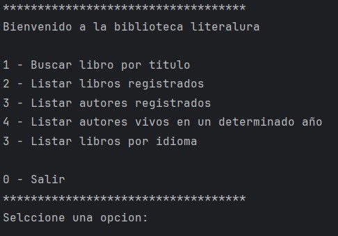
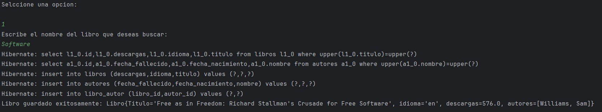
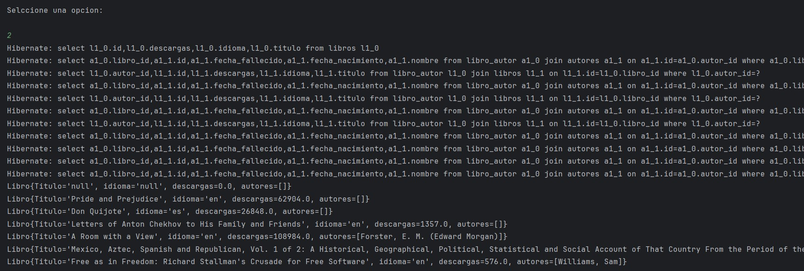
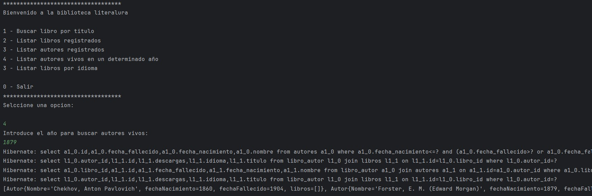

# Challenge Literalura 📖

## Objetivo
Este challenge consistió en desarrollar una aplicación de consola en **Java** que interactúa con la **API de Gutendex** para buscar y gestionar información sobre libros.  
El programa permite a los usuarios **registrar libros y autores en una base de datos local**, consultar los registros por diferentes criterios y obtener información relevante como el número de descargas y el idioma.

La aplicación utiliza **Spring Boot** para la gestión de la persistencia de datos con **JPA y Hibernate**, lo que nos permite mapear objetos de Java a entidades en una base de datos relacional.

---

## Aprendizaje
Durante el desarrollo de este proyecto, se aplicaron y reforzaron varios conceptos clave de **Java y Spring**:

- **Consumo de APIs**: Uso de `HttpClient` y `HttpRequest` para realizar solicitudes a la API de Gutendex y obtener datos de libros.
- **Manejo de JSON**: Conversión de respuestas JSON a objetos Java (DTOs) utilizando la biblioteca **Jackson** o **Gson**.
- **Programación Orientada a Objetos (POO)**: Creación de clases (`Libro`, `Autor`, etc.) para modelar el dominio del problema.
- **Persistencia de Datos con JPA**: Mapeo de entidades a tablas de la base de datos con anotaciones como `@Entity`, `@Table`, y gestión de relaciones (`@ManyToMany`) para vincular libros y autores.
- **Transacciones de Base de Datos**: Uso de **Spring Data JPA** para manejar operaciones de guardar, buscar y eliminar datos de manera eficiente y segura.
- **Manejo de Errores**: Implementación de lógica para gestionar excepciones comunes como `LazyInitializationException` y `StackOverflowError` en relaciones bidireccionales.

---

## Manual de uso

El programa se ejecuta desde la línea de comandos y presenta un **menú interactivo**:

### Menú principal
Al iniciar el programa, se despliega un menú con las siguientes opciones:

1. Buscar libro por título
2. Listar libros registrados
3. Listar autores registrados
4. Listar autores vivos en un determinado año
5. Listar libros por idioma
6. Salir

---

### Buscar libro
El usuario puede ingresar el título de un libro para buscarlo en la API de **Gutendex**.  
Si el libro no está registrado, se descarga su información y se guarda en la base de datos local junto con sus autores.

---

### Listar registros
Las opciones de listar permiten visualizar los **libros** y **autores** que ya han sido guardados en la base de datos, con detalles como:

- Título
- Autor
- Idioma
- Número de descargas
- Año de nacimiento/fallecimiento del autor

---

### Filtrado por año e idioma
- Se pueden buscar autores que estuvieran vivos en un año específico.
- También es posible filtrar los libros por idioma.

---

## Tecnologías utilizadas
- **Java 17**
- **Spring Boot**
- **Spring Data JPA / Hibernate**
- **Gutendex API**
- **MySQL / PostgreSQL (base de datos)**
- **Gson / Jackson**

---
